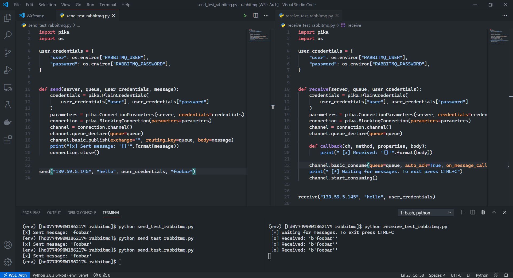

# popcorn
A polyrepo for a few in-house developed utilities and tools.

## Included tools

### Soda Opener

Soda Opener is a tiny PowerShell script which reads a text file for a list of URLs and opens them all in separate Google Chrome tabs. The following kinds of URLs are supported:

- apex domains
- www subdomain
- full domains

Use `soda.txt` to list out the URLs and then run `opener.ps1` using Microsoft PowerShell:

```powershell
PS C:\soda-opener> .\opener.ps1
```

**NOTE**: You should have Google Chrome installed on your computer for this to work!

**Coming soon**:

- Support for different browsers.
- A GUI for the same.

### Ansible Forge

Ansible Forge is a collection of Ansible playbooks and tools (built using Ansible APIs, Python etc.).
The other intended purpose for this repo is to serve as the source for Ansible Playbooks for our AWX instance that is currently being built.

The following playbooks are included:

- Install Docker CE on CentOS 8
- Install NGINX on CentOS 8
- Install Prometheus Server on CentOS 8
- Install node_exporter for Prometheus monitoring
- Gather service facts for Prometheus, node_exporter, Grafana, Docker and NGINX
- Gather service facts for just the monitoring stack (Prometheus, node_exporter, and Grafana)

Coming soon:

- Idempotent service start
- NGINX firewall configuration
- Install Grafana on CentOS 8

**NOTE**: *The monitoring stack is still a build-in-process. Coming soon is alertmanager integration*.

### Pier

Pier is a Python tool to obtain information about Docker containers. It can be statistics such as:

- Memory usage
- CPU usage
- Storage details
- ID
- Name

etc.

Before running `pier.py`, install the required dependencies using the `requirements.txt`:

```bash
pip install
```

Planning to convert this to a Flask app and write a mobile app using Flutter to manage Docker containers remotely using a mobile platform.

**Coming soon**:

- Support for more related technologies like Kubernetes, LXC, etc.

### Aqueduct

Aqueduct is **shunyaek**'s internal system for transporting data from various different sources to various different destinations. It has been implemented using `RabbitMQ`.

Aquaduct at **shunyaek** is monitored using `Prometheus` and `Grafana`.



In the above screen grab, you can see `send.py` sending a message and `receive.py` receiving the message, in the split terminal window on the bottom.

**Notes**: Work In Progress - *This project is currently in the development stage. More features coming soon*.
